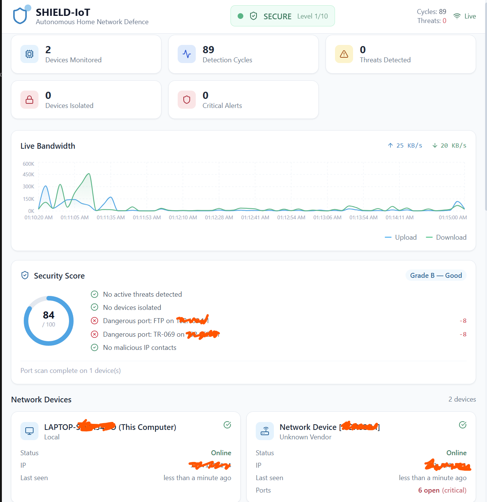
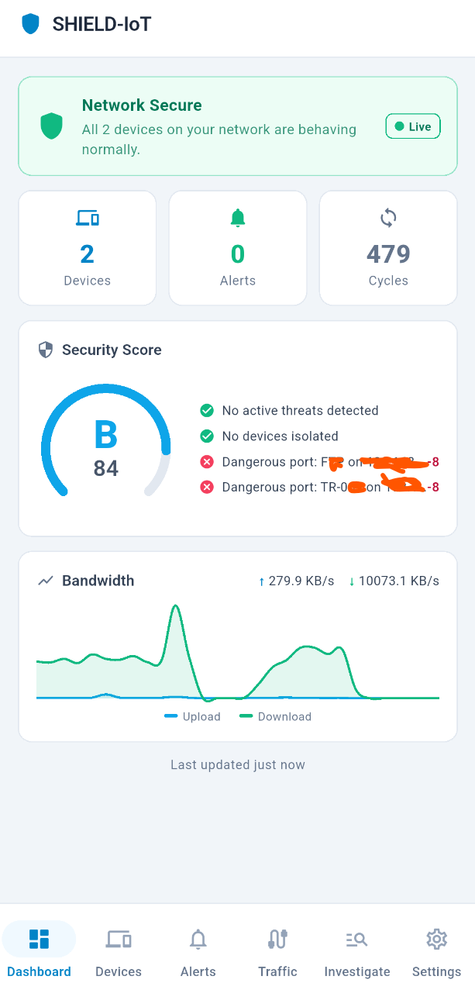
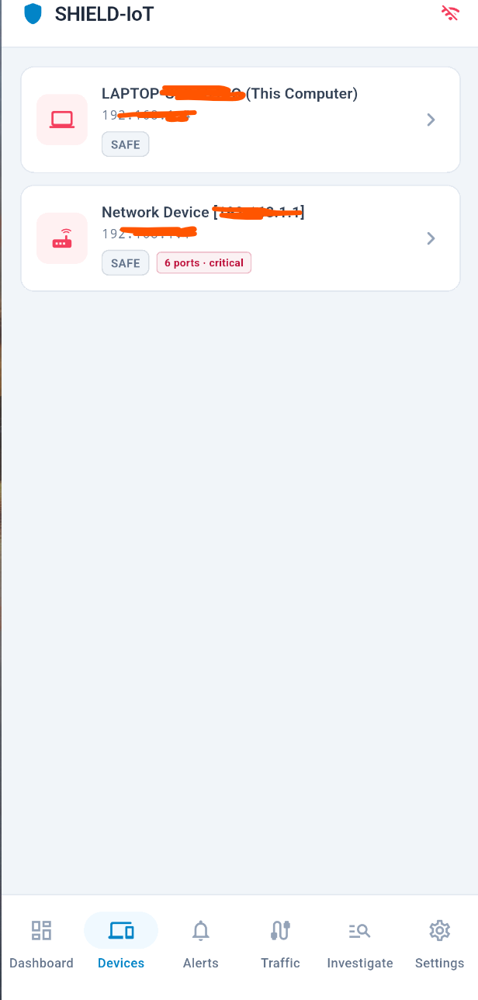
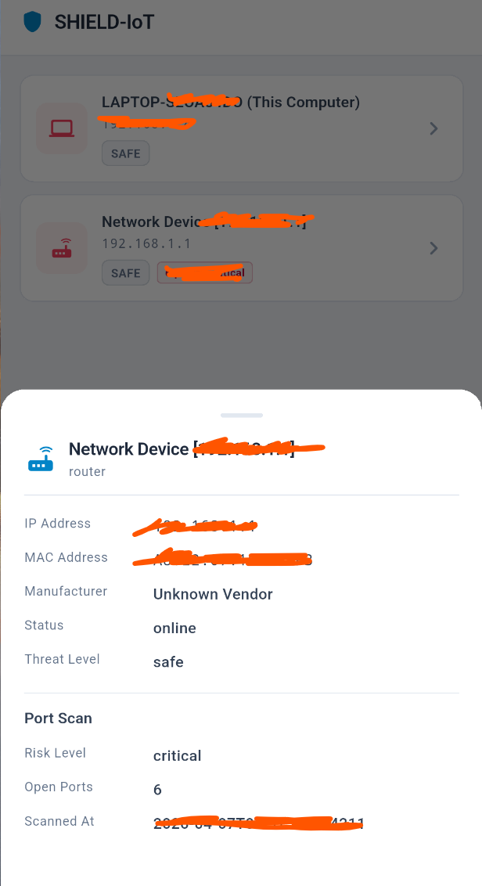
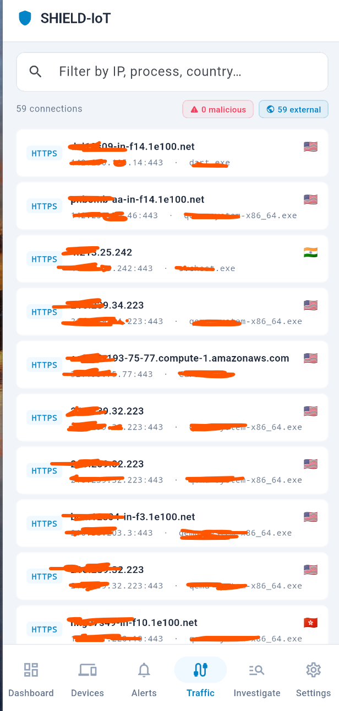
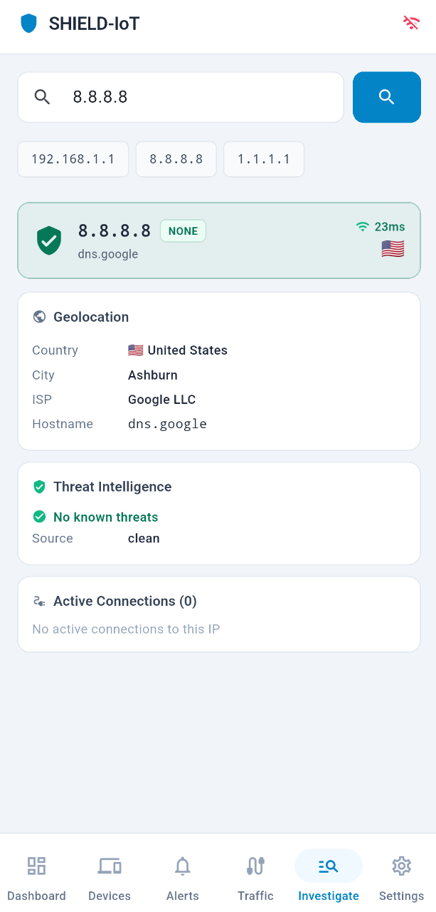
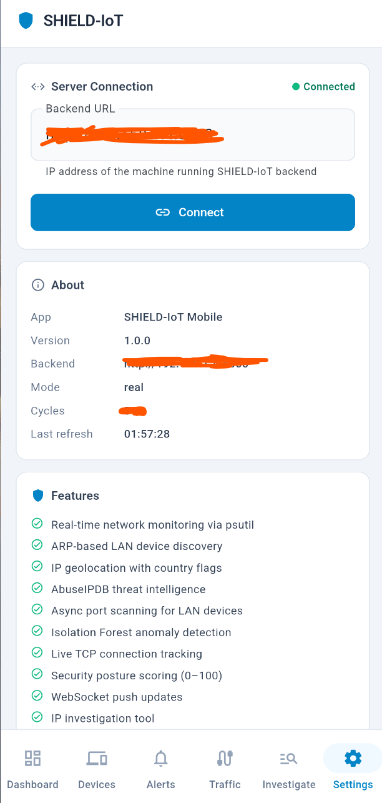

# SHIELD-IoT 🛡️
### Agentic AI for Autonomous Home Network Defence

> **iSAFE Hackathon 2026 — Track 2: Defend the Digital Citizen**

[](LICENSE)
[](https://python.org)
[](https://react.dev)
[](https://fastapi.tiangolo.com)
[](https://flutter.dev)

---

## The Problem

The average household has 10–15 smart IoT devices — cameras, baby monitors, smart speakers, thermostats — each running lightweight firmware with minimal security. AI-driven IoT attacks surged 54% in 2026. Autonomous malware now compromises a device in under 60 seconds.

**The citizen has no defence.** Intrusion detection systems require deep expertise and cost thousands. Nothing equivalent exists for ordinary people.

## The Solution

SHIELD-IoT is an **agentic AI system** that autonomously monitors, detects, and neutralises cyber threats targeting smart devices on a home network — with **zero technical knowledge required** from the user.

### How It Works — Four Continuous Phases

```
┌─────────────────────────────────────────────────────────────────┐
│                    SHIELD-IoT Agent Loop                        │
│                                                                  │
│  1. OBSERVE ──► 2. REASON ──► 3. ACT ──► 4. EXPLAIN            │
│                                                                  │
│  Passive traffic    LLM-based      Isolate device    Plain     │
│  monitoring +       threat          Block traffic     language  │
│  per-device         assessment      Log forensics     alert     │
│  baseline                                                        │
└─────────────────────────────────────────────────────────────────┘
```

---

## Screenshots















---

## Quick Start

### Prerequisites
- Python 3.11+
- Node.js 18+
- An [Anthropic API key](https://console.anthropic.com) *(optional — falls back to rule-based reasoning)*

### Backend Setup

```bash
cd backend
pip install -r requirements.txt
cp .env.example .env
# Add your API keys to .env (see .env.example for the full list)
python main.py
```

The API server starts at `http://localhost:8000`. OpenAPI docs at `/docs`.

### Frontend Setup

```bash
cd frontend
npm install
npm run dev
```

Dashboard opens at `http://localhost:5173`.

### Mobile App (Flutter)

```bash
cd shield_iot_mobile
flutter pub get
flutter run
```

Set the server URL in the app's **Settings** tab to the IP of the machine running the backend.

### Running a Demo

1. Start the backend — it immediately begins monitoring real network traffic
2. Start the frontend and open the dashboard
3. Check the **Security Score** card to see your current network posture
4. Use the **IP Investigator** to scan any device on your network
5. Expand any alert to see the full **Agent Reasoning Chain**

---

## Architecture

```
shield-iot/
├── backend/
│   ├── main.py                    # FastAPI server + WebSocket
│   ├── agent/
│   │   ├── monitor.py             # Core observe→reason→act→explain loop
│   │   ├── baseline.py            # Per-device behavioural baseline (EMA)
│   │   ├── anomaly_detector.py    # Isolation Forest + rule-based detection
│   │   ├── reasoning_core.py      # LLM agentic reasoning
│   │   ├── response_executor.py   # Autonomous response (isolate/block)
│   │   ├── geo_lookup.py          # IP geolocation enrichment
│   │   ├── port_scanner.py        # Async LAN port scanner
│   │   └── threat_intel.py        # Live threat intelligence feeds
│   ├── api/routes/
│   │   ├── devices.py             # Device management endpoints
│   │   ├── alerts.py              # Alert management endpoints
│   │   ├── network.py             # Network status, score, bandwidth
│   │   ├── connections.py         # Live TCP connection endpoint
│   │   └── investigate.py         # IP investigation endpoint
│   └── simulation/
│       ├── network_sim.py         # Realistic IoT traffic simulation
│       └── attack_sim.py          # Attack scenario engine
├── frontend/
│   └── src/
│       ├── App.tsx                # Main dashboard
│       ├── components/            # UI components
│       └── hooks/useWebSocket.ts  # Real-time WebSocket connection
└── shield_iot_mobile/             # Flutter mobile app
    └── lib/
        ├── main.dart
        ├── screens/               # Dashboard, Devices, Alerts, Connections, Investigate
        ├── services/              # API client + Provider state
        └── widgets/               # Reusable UI components
```

### Technical Stack

| Component | Technology |
|-----------|-----------|
| Agentic Reasoning | LLM API (rule-based fallback included) |
| Anomaly Detection | Isolation Forest (scikit-learn) |
| Behavioural Baseline | Exponential Moving Average per device |
| Backend API | FastAPI + WebSockets |
| Traffic Monitoring | psutil — OS-level TCP connection capture |
| Device Discovery | ARP cache scan |
| Geolocation | ip-api.com batch API |
| Threat Intelligence | AbuseIPDB + built-in IOC list |
| Port Scanning | Async TCP probe |
| Frontend Dashboard | React 18 + TypeScript + Tailwind CSS |
| Mobile App | Flutter 3.35 (Android + iOS) |
| Charts | Recharts (web), fl_chart (mobile) |

---

## Attack Scenarios (Demo)

| Scenario | Target Device | Attack Type | What SHIELD Does |
|----------|--------------|-------------|-----------------|
| Mirai Botnet Recruitment | Baby Monitor | C2 beacon + exfil | Isolates device, blocks C2 IP |
| IP Camera Exfiltration | Front Door Camera | Data exfiltration | Quarantines, logs forensics |
| Network Reconnaissance | Smart Thermostat | Port scanning | Blocks internal scans |
| Router Brute Force | Smart TV | SSH brute force | Blocks attack traffic |
| DNS Tunnelling | Smart Speaker | Covert C2 channel | Isolates, generates report |

---

## API Reference

Full interactive docs are available at `/docs` once the backend is running.

### Endpoint Groups

- **`/api/devices/`** — device list, detail, port scan, baseline, isolation
- **`/api/alerts/`** — alert list, detail, reasoning log, dismiss
- **`/api/network/`** — status, security score, bandwidth history, threat intel, action log
- **`/api/connections/`** — live TCP connection snapshot with geo enrichment
- **`/api/investigate/{ip}`** — full parallel intelligence lookup for any IP

### WebSocket — Real-Time Events

Connect to `ws://<host>/ws` to receive push events:

```json
{ "type": "alert",         "data": { ... } }
{ "type": "device_update", "data": { ... } }
{ "type": "status_update", "data": { ... } }
{ "type": "heartbeat",     "ts":   "..." }
```

---

## Privacy Safeguards

SHIELD-IoT is designed with privacy as a core principle:

- **Metadata only** — analyses packet headers, connection counts, and destination IPs. Never stores payload data.
- **Local processing** — all baseline models and anomaly detection run locally on your hardware.
- **LLM API** — only structured anomaly summaries (no raw traffic data) are sent for reasoning.
- **No cloud dependency** — falls back to rule-based reasoning if the LLM API is unavailable.
- **Open source** — every line of code is auditable under the MIT Licence.

---

## Production Deployment

See [`docs/deployment.md`](docs/deployment.md) for full deployment guidance including:
- Raspberry Pi 4 deployment (recommended for home use)
- Docker Compose setup
- OpenWrt router integration
- Real passive traffic capture

---

## Societal Impact

SHIELD-IoT is built for the digital citizen who has never heard the term "intrusion detection" — families with smart home devices, senior citizens with connected health monitors, small business owners with IP cameras.

Every compromised baby monitor, every hacked router, every botnet-recruited smart TV represents a real person whose privacy was violated without them knowing. SHIELD-IoT makes **autonomous AI defence a basic digital right — not an enterprise luxury**.

---

## Licence

MIT Licence — see [LICENSE](LICENSE)

## Team

Built for iSAFE Hackathon 2026 — Track 2: Defend the Digital Citizen

> *The same AI capabilities attackers are using to compromise home networks in seconds are available to defenders. The only reason ordinary citizens remain unprotected is that no one has built an accessible, autonomous system for them. That is what we are here to do.*
